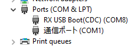

# VoiceNavi
For operation manuals, refer to [VoiceNavi](http://www.voicenavi.co.jp/).

## Supported devices

- 5A2

To switch between different devices, use MS1 and MS2 solder pads.

MS1 | MS2 | Device
:---: | :---: | :---:
Open | Open | 5A2

## How to use (on Windows)
To edit source code, use [E2 Studio](https://www.renesas.com/us/en/software-tool/e-studio). Version used for this project is 2021-04 (21.4.0).

For updating FW, use [Renesas Flash Programmer V3](https://www.renesas.com/us/en/software-tool/renesas-flash-programmer-programming-gui#download).
 - Power off the device and set **boot** jumper.
 - Move SBPOW1 switch from **Host** to **Slave**.
 - Plug in USB cable and connect to PC.
 - Power on the device. To check if the device is recognised by PC, go to Device Manager and look at Ports.

 
 - In Renesas Flash Programmer, create new project.

 

 - Under *Tool* select *Com port*, under *Tool Details* select port which corresponds to RX USB Boot (Device Manager).
 - Click connect to check if you can connect to device. ID Code is all **F**s.
 - In operation tab, make sure you have **little endian** selected.
 - *Program File* is VoiceNavi.mot, located in VoiceNavi/HardwareDebug. If file or folder is missing, compile the project from E2 Studio or download the file from releases page.
 - Press *Start* button to begin download.
 - After download is completed, turn off power, unplug USB cable, move SBPOW1 back to **Host** and remove **boot** jumper.
